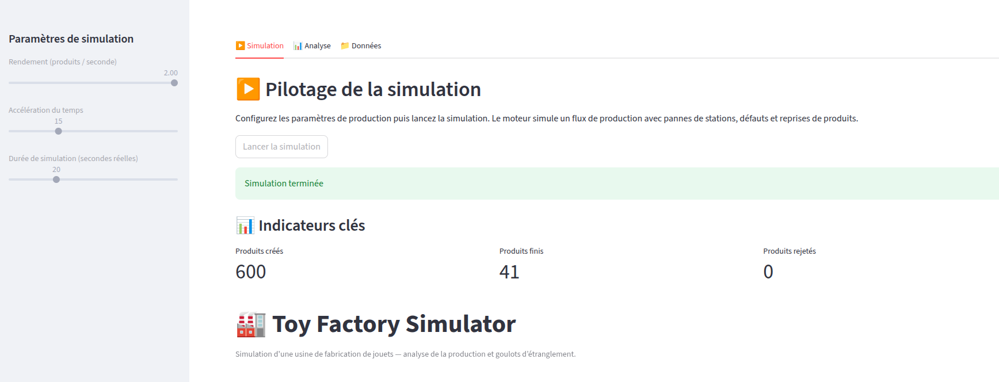

  
  
  

🚀 **Live demo** : https://toyfactory.streamlit.app/

# Toy Factory - Simulation de production industrielle
## 🧩 Problème abordé

Dans un système industriel réel, la performance globale est souvent limitée
par une seule étape critique (goulot d’étranglement), difficile à identifier
sans instrumentation adaptée.

Ce projet vise à simuler une chaîne de production réaliste afin de :
- mesurer objectivement la charge des stations
- identifier les points de saturation
- tester des scénarios d’optimisation

## Description
**Toy Factory** est une simulation d'une usine de fabrication de jouets.
Le projet modélise une chaîne de production composée de 4 stations successives (*assemblage*, *peinture*, *contrôle qualité*, *emballage*), avec gestion du temps, des pannes, des défauts et des reprises de fabrication.

L'objectif principal est de :
- simuler un flux de production réaliste,
- analyse les performances de l'usine,
- produire un rapport de production exploitable,
- identifier les goulots d'étranglements du système.

## 🎯 Objectifs pédagogiques et techniques

- Concevoir une architecture orientée objet claire et extensible
- Mettre en œuvre une simulation temporelle discrète
- Gérer des états complexes (idle, processing, panne)
- Exploiter des logs professionnels
- Produire des indicateurs de performance industrielle
- Préparer le terrain pour une analyse data (bottlenecks, temps moyens, taux de reprise)

## 🖥️ Interface

